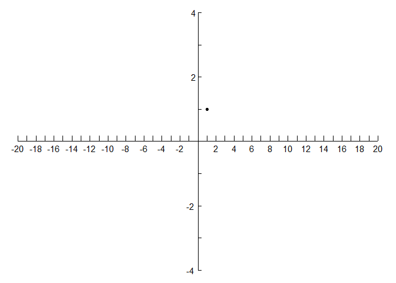
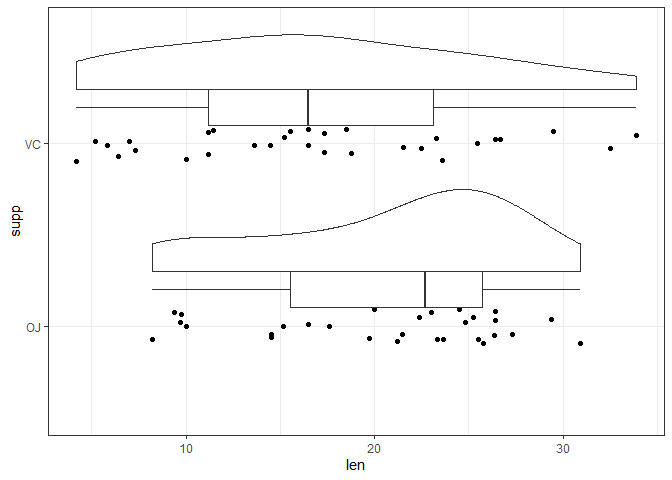

<!-- README.md is generated from README.Rmd. Please edit that file -->

# aggregatesR

<!-- badges: start -->
<!-- badges: end -->

This package contains visualization, analysis, and other miscellaneous
functions that I frequently used.

## Installation

You can install the development version of `aggregatesR` from
[github](https://github.com) with:

``` r
# install.packages("devtools")
devtools::install_github("Github-Yilei/aggregatesR")
```

## Description

This is a basic example which shows you how to solve a common problem:

### draw\_axis\_line()

``` r
library(aggregatesR)
library(ggplot2)
p <- draw_axis_line(20, 4)
p + geom_point(aes(x =1, y =1))
```



### set\_aspera\_fq()


### geom\_flat\_violin

``` r
library(ggplot2)
library(aggregatesR)

ggplot(ToothGrowth, aes(x = supp, y = len))  +
    geom_flat_violin(position = position_nudge(x = 0.3)) +
    geom_jitter(width=.1) +
    geom_boxplot(width = 0.2, position = position_nudge(x = 0.2)) +
    coord_flip() + theme_bw()
```


